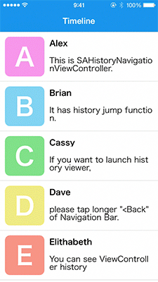

# Awesome Swift UI
A collaborative list of awesome swift UI/UX libraries. Inspired by [cjwirth]'s excellent [Awesome-iOS-UI][awesome-ios-ui].

## Other lists
- Looking for core libraries? _Check out_ [dkhamsing/awesome-swift]
- Looking for android? _Check out_ [wasabeef/awesome-android-ui]

## Index
- Animation
- Button
- Calendar
- Dialog
- Effect
- Field
- Photo/Video
- Progress
- Refresh
- Table/Collection View
- Tutorial/Onboarding
- Other

### Animation

Name                                                                                                     | License             | Sample
-------------------------------------------------------------------------------------------------------- | ------------------- | --------------------------------------------------------------------------------------------------------------------------------------------------------------------------------------------------------------------------------------
[SAHistoryNavigationViewController](https://github.com/szk-atmosphere/SAHistoryNavigationViewController) | [MIT]               |   
[Tispr Card Stack](https://github.com/tispr/tispr-card-stack)                                            | [Apache License V2] | 
[WobbleView](https://github.com/inFullMobile/WobbleView)                                                 | [MIT]               | 

### Button
### Calendar
### Dialog

Name                                                          | License | Sample
------------------------------------------------------------- | ------- | --------------------------------------------------------------------------------------------------------------------------------------------------------------------------------------------
[Swift-Prompts](https://github.com/GabrielAlva/Swift-Prompts) | [MIT]   |   

### Effect

Name                                               | License | Sample
-------------------------------------------------- | ------- | -------------------------------------------------------------------------------------------------------------------------------------------------------------
[Splitflap](https://github.com/yannickl/Splitflap) | [MIT]   |     

### Field

Name                                                              | License | Sample
----------------------------------------------------------------- | ------- | ------------------------------------------------------------------------------------------------------------------------------------------------------------------------------------------------------------------------------------------------------------------------------------------------------------------------------------------------------------------------------------------------------------------------------------------------------------------------------------------------------------------------------------------
[YALField](https://github.com/Yalantis/YALField)                  | [MIT]   |     
[TextFieldEffects](https://github.com/raulriera/TextFieldEffects) | [MIT]   |         
[TFBubbleItUp](https://github.com/thefuntasty/TFBubbleItUp)       | [MIT]   | 

### Photo/Video
### Progress
### Refresh
### Table/Collection View
### Tutorial/Onboarding

Name                                                      | License | Sample
--------------------------------------------------------- | ------- | -----------------------------------------------------------
[Presentation](https://github.com/hyperoslo/Presentation) | [MIT]   | 

### Other

[cjwirth]: https://github.com/cjwirth
[dkhamsing/awesome-swift]: https://github.com/matteocrippa/awesome-swift#ui
[wasabeef/awesome-android-ui]: https://github.com/wasabeef/awesome-android-ui
[awesome-ios-ui]: https://github.com/cjwirth/awesome-ios-ui
[mit]: http://opensource.org/licenses/MIT
[apache license v2]: https://www.apache.org/licenses/LICENSE-2.0
